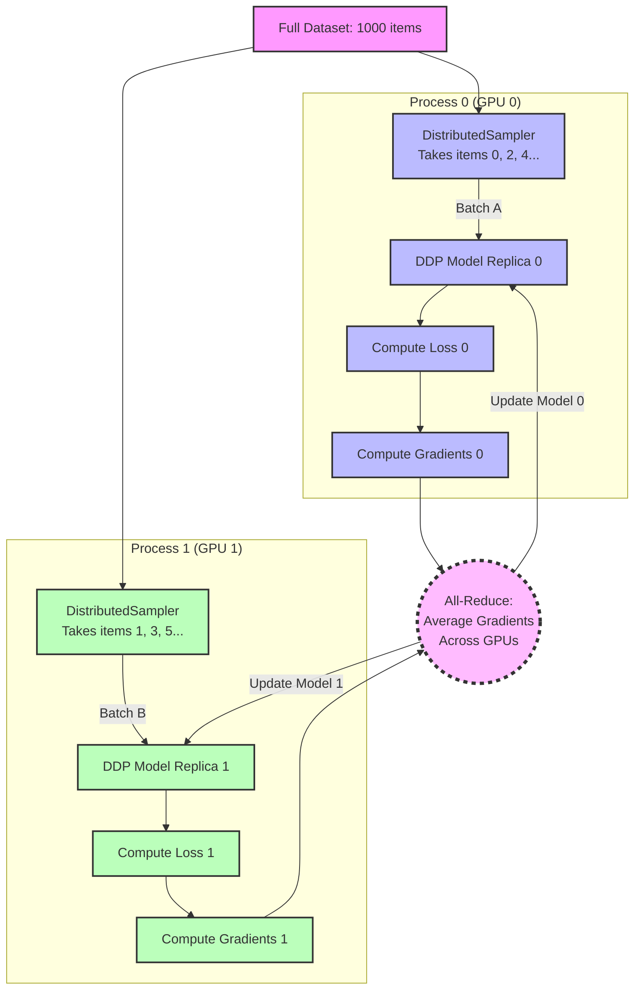

```mermaid
graph TD
    classDef main fill:#f9f,stroke:#333,stroke-width:2px;
    classDef gpu0 fill:#bbf,stroke:#333,stroke-width:2px;
    classDef gpu1 fill:#bfb,stroke:#333,stroke-width:2px;
    classDef sync fill:#fbf,stroke:#333,stroke-width:4px,stroke-dasharray: 5 5;

    Dataset[Full Dataset: 1000 items]:::main
    
    subgraph "Process 0 (GPU 0)"
        Sampler0[DistributedSampler<br/>Takes items 0, 2, 4...]:::gpu0
        Model0[DDP Model Replica 0]:::gpu0
        Loss0[Compute Loss 0]:::gpu0
        Grad0[Compute Gradients 0]:::gpu0
    end

    subgraph "Process 1 (GPU 1)"
        Sampler1[DistributedSampler<br/>Takes items 1, 3, 5...]:::gpu1
        Model1[DDP Model Replica 1]:::gpu1
        Loss1[Compute Loss 1]:::gpu1
        Grad1[Compute Gradients 1]:::gpu1
    end

    Dataset --> Sampler0
    Dataset --> Sampler1
    
    Sampler0 --> |Batch A| Model0
    Sampler1 --> |Batch B| Model1
    
    Model0 --> Loss0
    Model1 --> Loss1
    
    Loss0 --> Grad0
    Loss1 --> Grad1
    
    AllReduce((All-Reduce:<br/>Average Gradients<br/>Across GPUs)):::sync
    
    Grad0 --> AllReduce
    Grad1 --> AllReduce
    
    AllReduce --> |Update Model 0| Model0
    AllReduce --> |Update Model 1| Model1
```
