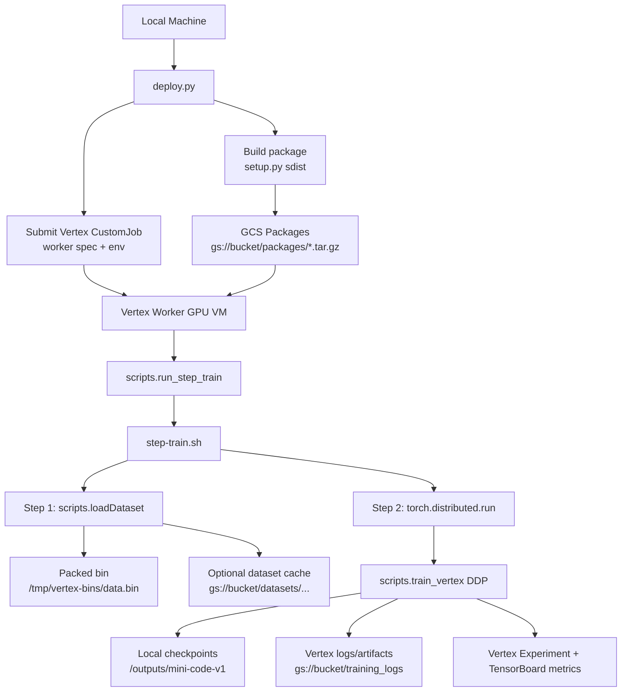

## Quick Deployment Summary

1. package project
2. submit Vertex custom job
3. run dataset packing in worker
4. run DDP training
5. save checkpoints locally and sync artifacts to GCS 

## High-level diagram



### Control plane vs data plane

1. Control plane (`deploy.py`):

   - Parses CLI/`@args` inputs.
   - Builds + uploads the Python source distribution.
   - Creates `python_package_spec` (image, module, env vars).
   - Submits `aiplatform.CustomJob(...).run(...)`.
2. Data plane (`scripts/step-train.sh` inside worker):

   - Materializes packed data (`scripts.loadDataset`).
   - Launches DDP training (`torch.distributed.run` -> `scripts.train_vertex`).
   - Produces checkpoints, logs, and run metrics.

### Where each thing goes

- Source package:
  - Built locally in `dist/*.tar.gz`.
  - Uploaded to `gs://<bucket>/packages/<tarball>`.
- Packed dataset bin:
  - Created on worker disk at `DATA_BIN_DIR/DATA_BIN_NAME` (default `/tmp/vertex-bins/data.bin`).
  - Optional bucket cache enabled with `ENABLE_BUCKET=1` and bucket path controls (`DATASET_NAME` / `BUCKET_DATASET_PATH`).
- Training checkpoints/artifacts:
  - Local worker path from `LOCAL_CKPT_DIR` (default `/outputs/mini-code-v1`).
  - Vertex job artifacts and logs under `base_output_dir` (default `gs://<bucket>/training_logs`).
- Experiment metadata:
  - Vertex experiment/run naming via `TRAIN_VERTEX_EXPERIMENT_NAME` and `TRAIN_VERTEX_RUN_NAME`.
  - TensorBoard + Vertex metric publishing controlled by `TRAIN_ENABLE_TENSORBOARD` and `TRAIN_ENABLE_VERTEX`.

### Runtime sequence in detail

1. `deploy.py` builds the package using `setup.py sdist --formats=gztar`.
2. It uploads the latest tarball to GCS under `packages/`.
3. It submits a Vertex `CustomJob` with:
   - worker machine spec (CPU/GPU/replicas/disk),
   - executor image (`--train_image`),
   - module entrypoint (`--train_module`, default `scripts.run_step_train`),
   - env vars for dataset packing + training hyperparameters.
4. Vertex starts worker VM(s), installs the uploaded package, and runs the module.
5. `scripts/step-train.sh` prints machine specs and storage state.
6. Step 1 (`scripts.loadDataset`) packs tokenized samples into one `.bin` file.
7. Step 2 starts distributed training with `torch.distributed.run` and `NPROC_PER_NODE`.
8. `scripts.train_vertex` trains, evaluates, logs metrics, and saves periodic checkpoints.
9. Job ends; artifacts remain in configured local/GCS outputs and are visible in Vertex job history.

## Deployment Flow Used

### 1) Build + upload package + submit Vertex job

```bash
python deploy.py \
  --project_id <gcp-project> \
  --region us-central1 \
  --bucket_uri gs://<bucket> \
  --machine_type g2-standard-24 \
  --accelerator_type NVIDIA_L4 \
  --accelerator_count 2 \
  --replica_count 1 \
  --boot_disk_size 300 \
  --nproc_per_node 2 \
  --display_name distilled-llm-train
```

`deploy.py` does this sequence:

1. `python setup.py sdist --formats=gztar`
2. upload tarball to `gs://<bucket>/packages/...`
3. submit Vertex `CustomJob` with env vars for data packing + training

### 2) Worker entrypoint pipeline

Inside Vertex worker, `scripts/step-train.sh` runs:  

```bash
python -m scripts.loadDataset ...
python -m torch.distributed.run --nproc_per_node=<N> --module scripts.train_vertex --bin_path <packed_bin>
```
