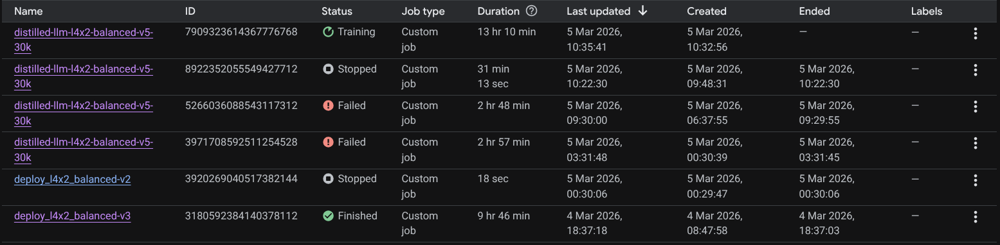
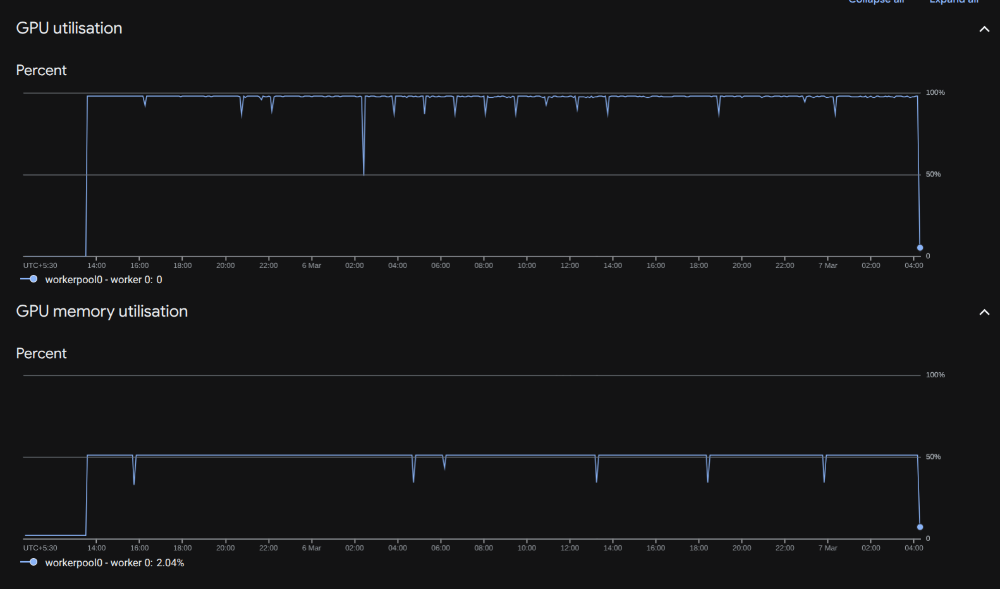
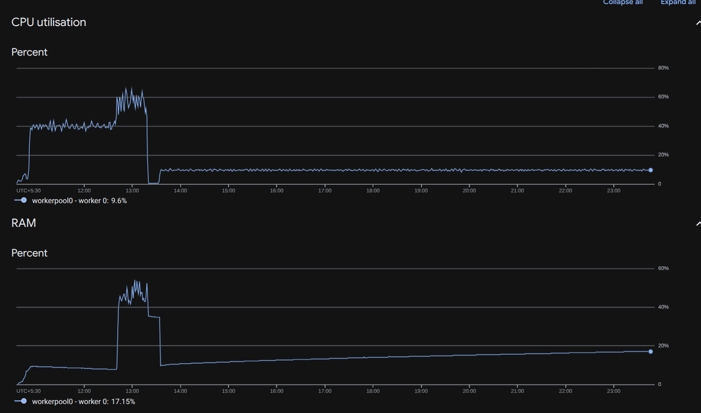

# Purpose

I built this model to deeply understand how distillation works between teacher and student models.

# Scope

After training an autoregressive model on TinyStories, I wanted to go further. I moved to a math-reasoning model trained on selected subsets of `math-ai/AutoMathText`:

1. `0.70-to-1.00`
2. `0.60-to-1.00`

These subsets were about 10GB in total.

# Key Learnings

## Data Processing

With larger corpora, tokenization and packing became a bigger bottleneck than model training itself.

The pipeline that worked well:

```text
HF dataset
    -> Tokenize
    -> Pack
    -> Save .bin + .idx
    -> Memory-map
    -> Torch Dataset
    -> DataLoader
    -> Model
```

This reduced overall iteration time significantly.

## Dataset Sampling

I used fixed dataset sampling. Mixing multiple datasets during pre-training gave better generalization than staying on a single source.

## Checkpointing

I learned that optimizer/scaler states are required for resume checkpoints, but not strictly required for final inference checkpoints.

## Scaling Laws

I followed the Chinchilla-style heuristic: train on roughly `20 x params` tokens.

## Optimization Changes

- Added QK normalization to improve gradient stability and reduce overfitting behavior.
- Adjusted FFN alignment for better GPU kernel utilization and matmul throughput.

These improved stability and convergence smoothness.

## Deployment Setup

### Machine configuration

- `--machine_type g2-standard-24`
- `--accelerator_type NVIDIA_L4`
- `--accelerator_count 2`
- `--replica_count 1`
- `--boot_disk_size 300`

Approximate resources:

- RAM: `2*24 + 2*16 = 80 GB` (vCPU+GPU memory mapping estimate used during planning)
- VRAM: `2*24 = 48 GB`
- Disk: `300 GB`

### Why this setup

- Large disk was needed for packing large raw corpora safely.
- I iterated over multiple failed deployments to find stable packing + training settings.

Datasets used in packing:

```json
[
  {
    "name": "open-web-math/open-web-math",
    "split": "train",
    "text_column": "text"
  },
  {
    "name": "HuggingFaceFW/fineweb",
    "subset": "sample-10BT",
    "split": "train",
    "text_column": "text",
    "data_files": [
      "sample/10BT/000_00000.parquet",
      "sample/10BT/001_00000.parquet",
      "sample/10BT/002_00000.parquet",
      "sample/10BT/003_00000.parquet",
      "sample/10BT/004_00000.parquet",
      "sample/10BT/005_00000.parquet",
      "sample/10BT/006_00000.parquet",
      "sample/10BT/007_00000.parquet"
    ]
  },
  {
    "name": "incredible45/Gutenberg-BookCorpus-Cleaned-Data-English",
    "split": "train",
    "text_column": "context"
  }
]
```

# Images Analysis 

### Deployment timeline



### GPU utilization



### System utilization


